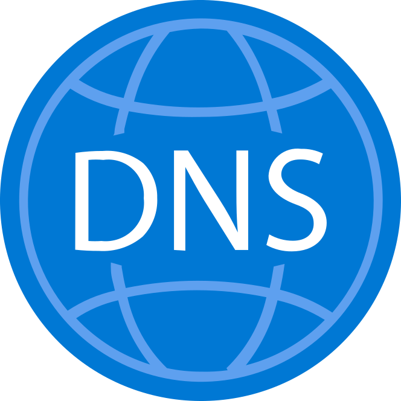

# DNSSEC-Indicator

A Google Chrome extension that uses DNS-over-HTTPS (DoH) to check the DNSSEC status for each domain you visit.

# How It Works

Each time you visit a new domain, this extension makes up to two DNS queries to your preferred DoH server to determine the DNSSEC status of that domain.

The DoH server can be a public service like `dns.google`, or locally hosted on the same machine.

The status of each domain is indicated by the color of the extension icon as described below.

|Icon|Status|Description|
|----|-----|-----------|
||Unsupported|The protocol is not in the protocols list, or the query returned a SERVFAIL|
||Secure|The query for the domain was successful and contained the AD bit|
||Insecure|The query for the domain was successful and did not contain the AD bit|
||Bogus|The query for the domain returned a SERVFAIL, but a second query for the domain with the CD bit was successful|
||Error|The query for the domain could not be completed, likely because of internet connectivity issues|

# Installation

First, download and build the extension:
```
git clone https://github.com/TrevinAvery/DNSSEC-Indicator.git
cd DNSSEC-Indicator
npm install
npm run prod
```

Second, install the unpacked extension into Chrome:

1. Open the Extension Management page by navigating to [chrome://extensions](chrome://extensions)
2. Enable Developer Mode by clicking the toggle switch next to **Developer mode**
3. Click the **Load unpacked** button and select the `DNSSEC-Indicator/dist` directory

You should now see the extension icon listed in the extensions drop down. You may wish to pin it to the URL bar for easy access.